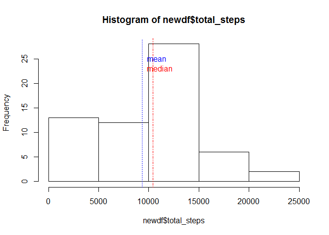

# Reproducible Research: Peer Assessment 1, Keith Maclaren


## Loading and preprocessing the data

```r
myact <- read.csv("activity.csv")
str(myact)
```

```
## 'data.frame':	17568 obs. of  3 variables:
##  $ steps   : int  NA NA NA NA NA NA NA NA NA NA ...
##  $ date    : Factor w/ 61 levels "2012-10-01","2012-10-02",..: 1 1 1 1 1 1 1 1 1 1 ...
##  $ interval: int  0 5 10 15 20 25 30 35 40 45 ...
```
Convert interval to a factor for analysis

```r
myact$interval <- factor(myact$interval)
str(myact)
```

```
## 'data.frame':	17568 obs. of  3 variables:
##  $ steps   : int  NA NA NA NA NA NA NA NA NA NA ...
##  $ date    : Factor w/ 61 levels "2012-10-01","2012-10-02",..: 1 1 1 1 1 1 1 1 1 1 ...
##  $ interval: Factor w/ 288 levels "0","5","10","15",..: 1 2 3 4 5 6 7 8 9 10 ...
```
## What is mean total number of steps taken per day?
Calculate Total steps taken per day:

```r
newdf <- aggregate(list(total_steps = myact$steps), list(date = myact$date), sum, na.rm=TRUE)
```
Histogram Plot of Total steps taken per day:

```r
hist(newdf$total_steps)
abline(v=mean(newdf$total_steps), lty=3, col="blue")                   # draw a blue line thru the mean  
abline(v=median(newdf$total_steps), lty=4, col="red")                  # draw a red line thru the median  
text(mean(newdf$total_steps),25,labels="mean", pos=4, col="blue")       
text(mean(newdf$total_steps),23,labels="median", pos=4, col="red")  
```

 

Mean & Median steps taken per day:

```r
summary(newdf$total_steps)
```

```
##    Min. 1st Qu.  Median    Mean 3rd Qu.    Max. 
##       0    6778   10400    9354   12810   21190
```


## What is the average daily activity pattern?


## Imputing missing values


## Are there differences in activity patterns between weekdays and weekends?
