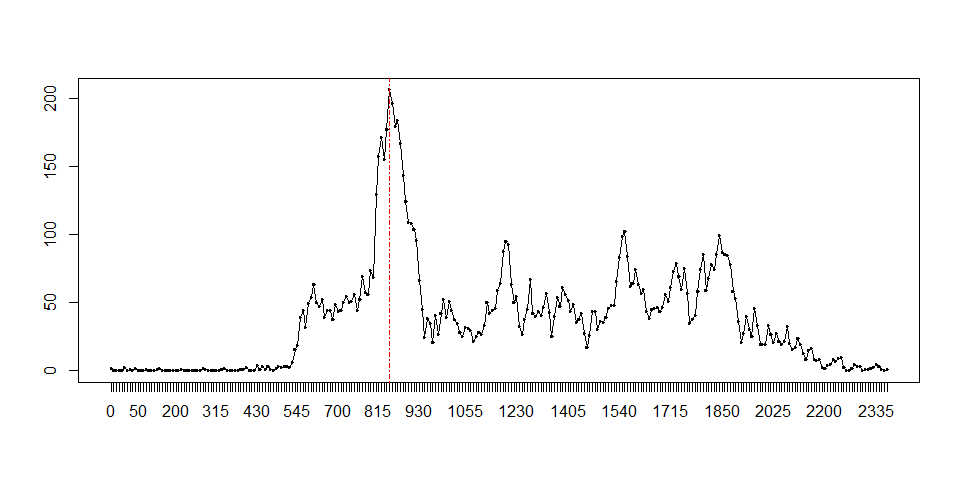
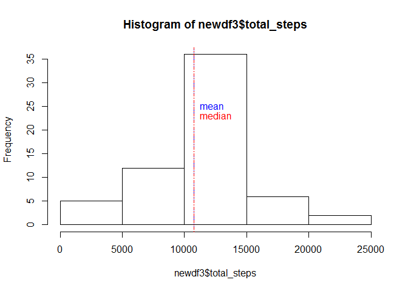
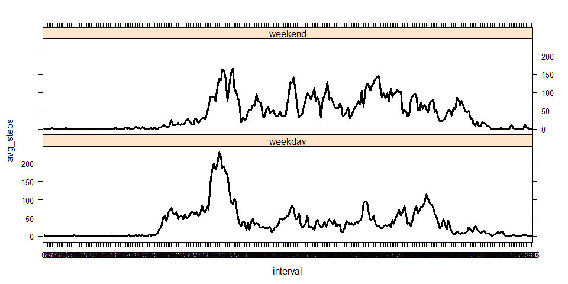

# Reproducible Research: Peer Assessment 1, Keith Maclaren


## Loading and preprocessing the data - csv file contained in zip file

```r
myact <- read.csv("activity.csv")
str(myact)
```

```
## 'data.frame':	17568 obs. of  3 variables:
##  $ steps   : int  NA NA NA NA NA NA NA NA NA NA ...
##  $ date    : Factor w/ 61 levels "2012-10-01","2012-10-02",..: 1 1 1 1 1 1 1 1 1 1 ...
##  $ interval: int  0 5 10 15 20 25 30 35 40 45 ...
```
Convert interval to a factor for analysis

```r
myact$interval <- factor(myact$interval)
str(myact)
```

```
## 'data.frame':	17568 obs. of  3 variables:
##  $ steps   : int  NA NA NA NA NA NA NA NA NA NA ...
##  $ date    : Factor w/ 61 levels "2012-10-01","2012-10-02",..: 1 1 1 1 1 1 1 1 1 1 ...
##  $ interval: Factor w/ 288 levels "0","5","10","15",..: 1 2 3 4 5 6 7 8 9 10 ...
```
## What is mean total number of steps taken per day?
Calculate Total steps taken per day:

```r
newdf <- aggregate(list(total_steps = myact$steps), list(date = myact$date), sum, na.rm=TRUE)
```
Histogram Plot of Total steps taken per day:

```r
hist(newdf$total_steps)
abline(v=mean(newdf$total_steps), lty=3, col="blue")                   # draw a blue line thru the mean  
abline(v=median(newdf$total_steps), lty=4, col="red")                  # draw a red line thru the median  
text(mean(newdf$total_steps),25,labels="mean", pos=4, col="blue")       
text(mean(newdf$total_steps),23,labels="median", pos=4, col="red")  
```

 

Mean & Median steps taken per day:

```r
summary(newdf$total_steps)
```

```
##    Min. 1st Qu.  Median    Mean 3rd Qu.    Max. 
##       0    6778   10400    9354   12810   21190
```


## What is the average daily activity pattern?

```r
newdf2 <- aggregate(list(avg_steps = myact$steps), list(interval=myact$interval), mean, na.rm=TRUE)
plot.new()
plot(newdf2$interval, newdf2$avg_steps, type="l")
lines(newdf2$interval, newdf2$avg_steps, col="black")
maxInt <- newdf2[which.max(newdf2$avg_steps),1]
abline(v=maxInt, lty=4, col="red")
```

 

## Imputing missing values
Calculate and report the total number of missing values

```r
cat("total records: ", nrow(myact))
```

```
## total records:  17568
```

```r
cat("total NAs: ",sum(is.na(myact)))
```

```
## total NAs:  2304
```
Strategy for filling in missing values = mean for that interval across all days

Create a new dataset with missing values filled in

```r
newact <- myact
# convert date to datetime class
newact$date <- as.Date(newact$date)
# loop through newact
for (i in 1:nrow(newact)) {
#   if find NA in newact$steps, replace with newdf2$steps (average) for matching interval
    if (is.na(newact[i,1])) {
        newact[i,1] <- newdf2[which(newdf2$interval == newact[i,3]), 2]
    }
}
```

Create a histogram of new dataset

```r
newdf3 <- aggregate(list(total_steps = newact$steps), list(date = newact$date), sum, na.rm=TRUE)
hist(newdf3$total_steps)
abline(v=mean(newdf3$total_steps), lty=3, col="blue")                   # draw a blue line thru the mean  
abline(v=median(newdf3$total_steps), lty=4, col="red")                  # draw a red line thru the median  
text(mean(newdf3$total_steps),25,labels="mean", pos=4, col="blue")       
text(mean(newdf3$total_steps),23,labels="median", pos=4, col="red")  
```

 

Show mean/median of new dataset

```r
summary(newdf3$total_steps)
```

```
##    Min. 1st Qu.  Median    Mean 3rd Qu.    Max. 
##      41    9819   10770   10770   12810   21190
```
Comparison from previous dataset
 - strengthens the mean, to the point the median == mean


## Are there differences in activity patterns between weekdays and weekends?

New factor variable for weekday & weekend (use weekdays() function against date variable)

```r
newact$daytype <- ifelse(weekdays(newact$date) %in% c("Saturday", "Sunday"), "weekend", "weekday")
```
Panel plot comparing activity plot by weekday & weekend

```r
library(lattice)
newdf4 <- aggregate(list(avg_steps = newact$steps), list(interval=newact$interval, daytype=newact$daytype), mean, na.rm=TRUE)
xyplot(avg_steps ~ interval| daytype,
       data=newdf4,
       lty=1,
       lwd=3,
       col.line="black",
       type="l",
       layout=c(1,2))
```

 
